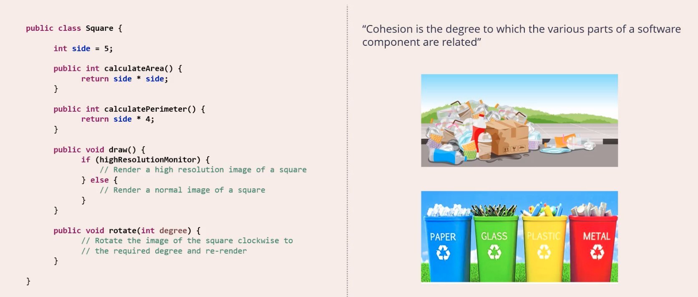
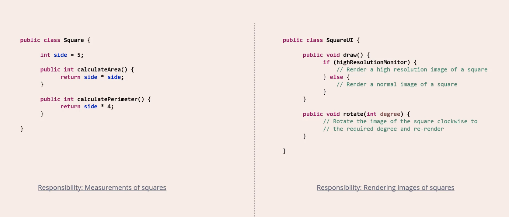
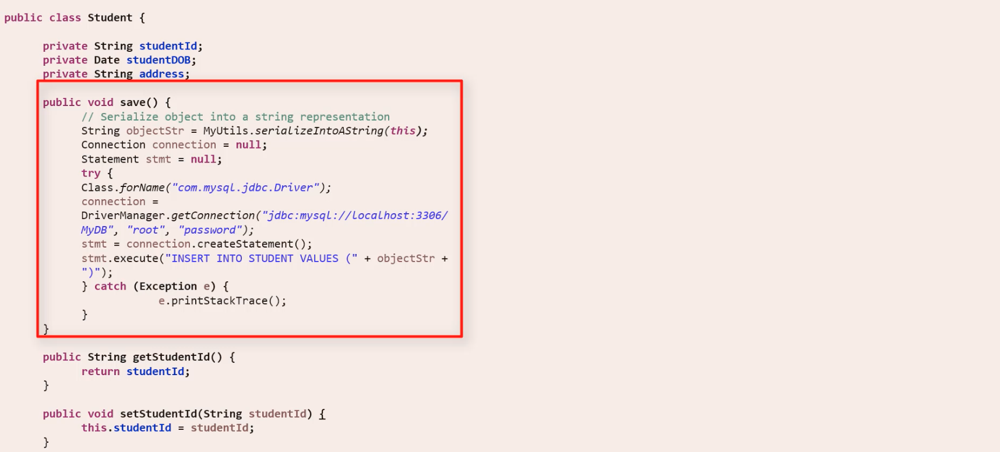
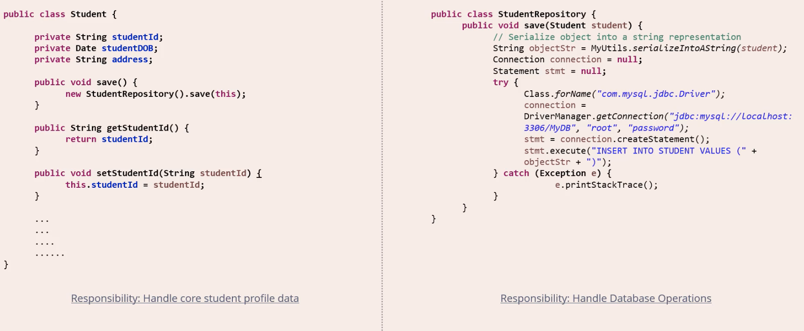

# 🔥01-Single Responsibility Principle (SRP) - Overview

**SOLID** এর 'S' হল Single Responsibility Principle, যা সাধারণত **SRP** নামে পরিচিত।

## SRP কি?

Single Responsibility Principle বলছে যে 'প্রতিটি সফটওয়্যার উপাদানের একটি এবং শুধুমাত্র একটি দায়িত্ব থাকা উচিত'। **[component should have one and only one responsibility']**

- [component should have one and only one (responsibility) **reason to change**]

 যখন আমরা সফটওয়্যার উপাদান বলি, তখন যদি আমরা একটি অবজেক্ট-অরিয়েন্টেড প্রোগ্রামিং ভাষা যেমন C++ এর প্রসঙ্গে কথা বলি, তবে আমাদের প্রথম মনে পড়ে একটি C++ ক্লাস।

কিন্তু এটি লক্ষ্য করা গুরুত্বপূর্ণ যে সফটওয়্যার উপাদানের ধারণাটি একটি পদ্ধতি, ফাংশন বা এমনকি একটি মডিউলকেও নির্দেশ করতে পারে। **তাই নিয়মটি বলছে যে একটি সফটওয়্যার উপাদানের শুধুমাত্র একটি দায়িত্ব থাকা উচিত।**

## উদাহরণ

আমাদের কাছে একটি ছবি আছে যা এটি ব্যাখ্যা করতে সাহায্য করবে। এটি একটি Swiss Army Knife। আপনি জানেন, একটি Swiss Army Knife বিভিন্ন কার্যকরী সরঞ্জামের সমন্বয়, প্রতিটি একটির আলাদা উদ্দেশ্য রয়েছে। এতে আপনি ক্যান ওপেনার থেকে শুরু করে মিনি কাঁচি বা স্ক্রু ড্রাইভার পর্যন্ত কিছু পেতে পারেন।

যদিও Swiss Army Knife একটি বহুমুখী সরঞ্জাম এবং খুব চাহিদাসম্পন্ন, সফটওয়্যারের ক্ষেত্রে নিয়মগুলি পরিবর্তিত হয়। যদি আপনি Swiss Army Knife কে একটি সফটওয়্যার উপাদান হিসেবে ভাবেন, তবে এটি Single Responsibility Principle লঙ্ঘন করে কারণ এতে একাধিক দায়িত্ব রয়েছে।

## What does SRP recommend?
SRP সুপারিশ করে যে আমাদের কাছে এমন একটি ছুরি থাকা উচিত যার একমাত্র দায়িত্ব কাটার কাজ করা। এটি ক্যান ওপেনার বা স্ক্রু ড্রাইভার হিসেবে ব্যবহার করা যাবে না; এটি শুধুমাত্র কাটার জন্য ব্যবহৃত হবে।

---

# 🔥02-Single Responsibility Principle (SRP) - Detailed Overview

## পরিচিতি
 Here Single Responsibility Principle (SRP)  এই নীতিটি কিভাবে তৈরি হয়েছে তা নিয়ে বিস্তারিত আলোচনা করব।

## Square ক্লাসের উদাহরণ
দেখুন, এখানে একটি ক্লাস আছে যার নাম **Square**। এতে ৪টি মেথড রয়েছে: `calculateArea()`, `calculatePerimeter()`, `draw()`, এবং `rotate()`।

- `calculateArea` এবং `calculatePerimeter` ফাংশনগুলি সঠিকভাবে কাজ করে, অর্থাৎ তারা একটি বর্গের পাশে দেওয়া দৈর্ঘ্য অনুযায়ী এর এলাকা এবং পরিধি গণনা করে।
- `draw()` ফাংশনটি স্কোয়ারের চিত্রটি প্রদর্শনে রেন্ডার করে এবং এটি ব্যবহৃত ডিসপ্লের ধরন অনুযায়ী বিভিন্ন কোড প্রবাহ রয়েছে।
- `rotate()` ফাংশনটি স্কোয়ারের চিত্রটি ঘুরিয়ে দেয় এবং এটি আবার ডিসপ্লেতে রেন্ডার করে।

### Cohesion কি?
এই কোড স্নিপেটের প্রসঙ্গে, আমরা একটি নতুন ধারণা শিখব যার নাম **Cohesion**। সফটওয়্যার জগতে, **কোহেশন হল বিভিন্ন অংশের মধ্যে সম্পর্কের ডিগ্রি।**

#### উদাহরণ:
একটি অগোছালো আবর্জনার কৌটো দেখুন। এখানে বিভিন্ন ধরনের জিনিস রয়েছে যেমন প্লাস্টিকের ক্যান, বিয়ারের বোতল, কাগজের বর্জ্য ইত্যাদি। এগুলোর মধ্যে সম্পর্ক খুঁজে পাওয়া কঠিন।

কিন্তু যখন এগুলো আলাদা করা হয়, তখন একটি হলুদ বিনে প্লাস্টিকের বোতলগুলি দেখা যায়। যদিও বোতলগুলি একরকম নয়, তবে তাদের মধ্যে একটি সাধারণ সম্পর্ক রয়েছে: তারা সব প্লাস্টিকের তৈরি।

**Cohesion এর সংজ্ঞা অনুযায়ী**, অগোছালো আবর্জনার কৌটোর বিষয়বস্তুতে কম কোহেশন রয়েছে, এবং প্রতিটি আলাদা আবর্জনার কৌটোর বিষয়বস্তুতে উচ্চ কোহেশন রয়েছে।

## Square ক্লাসে কোহেশন
Square ক্লাসের মেথডগুলোর দিকে তাকালে:

- `calculateArea` এবং `calculatePerimeter` মেথডগুলি একে অপরের সাথে ঘনিষ্ঠভাবে সম্পর্কিত, কারণ তারা বর্গের পরিমাপ নিয়ে কাজ করে। তাই তাদের মধ্যে উচ্চ কোহেশন রয়েছে।
- `draw()` এবং `rotate()` মেথডগুলি স্কোয়ারের চিত্র রেন্ডারিং নিয়ে কাজ করে, তাই তাদের মধ্যে উচ্চ কোহেশন রয়েছে।

কিন্তু যদি আপনি সমস্ত মেথডকে একসাথে বিবেচনা করেন, তবে কোহেশনের স্তর কম। উদাহরণস্বরূপ, `calculatePerimeter()` মেথডটি `draw()` মেথডের সাথে ঘনিষ্ঠভাবে সম্পর্কিত নয় কারণ তারা সম্পূর্ণ ভিন্ন দায়িত্ব নিয়ে কাজ করে।

### সমাধান

এখন আমি কিছু পরিবর্তন করব যাতে কোহেশনের স্তর বাড়ানো যায়। আমি `draw` এবং `rotate` মেথডগুলিকে একটি আলাদা ক্লাসে স্থানান্তর করব, যার নাম হবে **SquareUI**।

এভাবে, যদিও আমি মেথডগুলোকে দুইটি ক্লাসে ভাগ করেছি, আমি প্রতিটি ক্লাসে কোহেশনের স্তর বাড়িয়েছি। 

- **Square** ক্লাসে এখন দুটি মেথড ঘনিষ্ঠভাবে সম্পর্কিত, কারণ তারা বর্গের পরিমাপ নিয়ে কাজ করে।
- **SquareUI** ক্লাসে দুটি মেথডও ঘনিষ্ঠভাবে সম্পর্কিত, কারণ তারা বর্গের গ্রাফিক রেন্ডারিং নিয়ে কাজ করে।

## Coupling কি?
Coupling হল বিভিন্ন সফটওয়্যার উপাদানের মধ্যে **আন্তঃনির্ভরতায় স্তর।** [Coupling is defined as **the level of inter dependency between various software components.]**

- Loose Coupling helps attain better adherence to the **single responsibility principle**

### Student ক্লাস উদাহরণ

এখন আমরা একটি **Student** ক্লাস দেখি। এর মধ্যে একটি মেথড হল `save()` যা ছাত্র ক্লাসকে সিরিয়ালাইজড ফর্মে রূপান্তরিত করে এবং ডাটাবেসে সংরক্ষণ করে। 

যদি আপনি ভবিষ্যতে MySQL থেকে MongoDB তে চলে যান, তবে বেশিরভাগ কোড পরিবর্তন করতে হবে। তাই Student ক্লাসটি ডাটাবেস স্তরের সাথে শক্তভাবে যুক্ত।

### সমাধান

আমরা ডাটাবেস সম্পর্কিত কোডটিকে একটি নতুন **Repository** ক্লাসে স্থানান্তর করব। 

এভাবে আমরা শক্ত সংযোগ অপসারণ করেছি এবং এটিকে দুর্বল করেছি। এখন যদি আমরা অন্তর্নিহিত ডাটাবেস পরিবর্তন করি, Student ক্লাসটি পরিবর্তন বা পুনঃসংকলনের প্রয়োজন নেই; শুধুমাত্র Repository ক্লাস পরিবর্তন করতে হবে।

## উপসংহার
আমরা দুটি ধারণা দেখেছি - **Cohesion** এবং **Coupling**। 

- আমরা দেখেছি যে Low Chohesion is Bad 
- Single Responsibility Principle সর্বদা **High Cohesion** সমর্থন করে।
- আমরা দেখেছি যে শক্ত সংযোগ খারাপ।
- Single Responsibility Principle সর্বদা **Loose Cupling** সুপারিশ করে।

সুতরাং সর্বদা উচ্চ কোহেশন [**High Cohesion**] এবং দুর্বল সংযোগের [**Loose Cupling**] দিকে লক্ষ্য রাখুন। when ever we working on SRP

# 🔥03-Single Responsibility Principle (SRP) - Modified Definition

## পরিচিতি
আমরা সংজ্ঞাটির একটি নতুন দৃষ্টিভঙ্গি দেখব।

## নতুন সংজ্ঞা
মূল নীতি বলে: **'প্রতিটি সফটওয়্যার উপাদানের একটি এবং শুধুমাত্র একটি দায়িত্ব থাকা উচিত'**। 
এখন আমরা 'দায়িত্ব' শব্দটির পরিবর্তে 'পরিবর্তনের কারণ' (reason to change) শব্দটি ব্যবহার করব। 

তাহলে নতুন সংজ্ঞা হবে: **'প্রতিটি সফটওয়্যার উপাদানের একটি এবং শুধুমাত্র একটি পরিবর্তনের কারণ থাকা উচিত'**।
- [component should have one and only one **reason to change**]

### পরিবর্তনের কারণ কি?
In the words of the Greek Philosopher - Heraclitus . **"The only thing that is constant is change"**
it always keeps changing in Software industry

### উদাহরণ
আমরা পূর্ববর্তী সেশনের **Student** ক্লাসটি ব্যবহার করব। ধরুন এই ক্লাসটি একটি সফটওয়্যার মডিউলের অংশ যা ইতিমধ্যে উৎপাদনে রয়েছে। 

#### পরিবর্তনের সম্ভাব্য কারণ:
1. ছাত্র আইডির ফরম্যাটে পরিবর্তন
2. ছাত্র নামের ফরম্যাটে পরিবর্তন
3. প্রযুক্তিগত দলের পরামর্শ অনুযায়ী ডাটাবেস ব্যাকএন্ডে পরিবর্তন

আমরা তিনটি পরিবর্তনের কারণ চিহ্নিত করেছি।

### SRP এর সমস্যা
যদি একটি সফটওয়্যার উপাদানে একাধিক পরিবর্তনের কারণ থাকে, তবে তার পরিবর্তনের ফ্রিকোয়েন্সি বাড়বে। প্রতিটি পরিবর্তন বাগ প্রবেশের সম্ভাবনা বাড়ায়, যা পুনঃপরীক্ষণের জন্য সময় এবং অর্থ ব্যয় করে।

### সমাধান
আমরা পূর্ববর্তী  যে পদক্ষেপ নিয়েছিলাম, তা আবার গ্রহণ করব। ডাটাবেস অপারেশনগুলি আলাদা **Repository** ক্লাসে স্থানান্তর করব। 

#### ক্লাস বিভাজন:
- **Student ক্লাস**: ২টি পরিবর্তনের কারণ থাকবে।
- **Repository ক্লাস**: ১টি পরিবর্তনের কারণ থাকবে।

যদিও Student ক্লাসে ২টি কারণে সমস্যা রয়েছে, তবে যদি তারা ঘনিষ্ঠভাবে সম্পর্কিত হয়, তবে তাদের একত্রিত করা যেতে পারে। উদাহরণস্বরূপ, "ছাত্রের প্রোফাইলে পরিবর্তন" বলা যেতে পারে।

©️ [Bappa Saha Bapi](https://bappasaha.vercel.app/)

